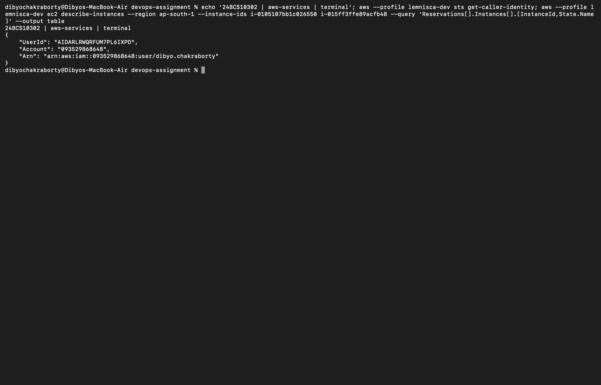

# Session 18 — AWS services research

Direct Mac Terminal capture of authenticated AWS identity (research sections below are conceptual, not claims that every service was provisioned):

Dibyo Chakraborty · 24BCS10302

| Service | Role in a deployment | Notes |
| --- | --- | --- |
| IAM | Identity and permissions | [IAM](01-iam/README.md) |
| EC2 | Virtual machines | [EC2](02-ec2/README.md) |
| S3 | Object storage | [S3](03-s3/README.md) |
| VPC | Isolated networking | [VPC](04-vpc/README.md) |
| DynamoDB / RDS | NoSQL / relational data | [Databases](05-dynamodb-rds/README.md) |

The Terraform exercises are in [terraform-s3-demo](../terraform-s3-demo/) and [cloud-terraform](../cloud-terraform/). These notes describe service concepts; they do not claim deployment of every service.
