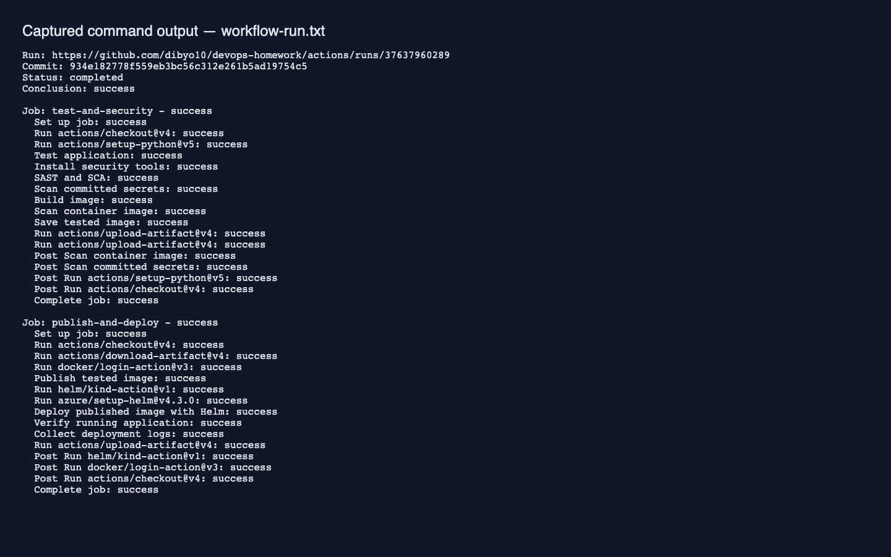

# Session 16: CI/CD and GitHub Actions

Student: Dibyo Chakraborty, 24BCS10302.

The runnable application and tests are in [`../final-devops-project/application`](../final-devops-project/application/). The [workflow](../.github/workflows/devops.yml) runs on main pushes, pull requests, and manual dispatch. Its `test-and-security` job performs CI; `publish-and-deploy` depends on that successful job and performs CD only on main.

A workflow contains jobs; each job runs on a fresh Ubuntu runner and contains checkout, setup, and shell steps. Tests validate health, readiness, JSON identity, metrics, and unknown routes. The Docker build produces the deployable artifact. The workflow uploads scan reports, pushes a commit-tagged GHCR image, then deploys and verifies it on a fresh kind Kubernetes cluster. The cluster is ephemeral and disappears with the runner; it is not a permanent public service.

The registry password is the built-in short-lived `GITHUB_TOKEN`, supplied through GitHub's secrets context. Logs never print it. Permissions are read-only by default; only publication receives package-write permission. Pull requests test and scan but cannot publish or deploy.

```bash
python3 -m unittest discover -s final-devops-project/application -v
gh workflow run devops.yml
gh run list --workflow devops.yml
```

## Executed pipeline

[Run 37637960289](https://github.com/dibyo10/devops-homework/actions/runs/37637960289) passed both jobs: tests/security and publication/deployment. The tested image was published and pulled as `ghcr.io/dibyo10/devops-homework:934e182778f559eb3bc56c312e261b5ad19754c5`, then deployed with Helm into kind. Rollout and HTTP health/metrics checks passed.

The [command transcript](workflow-run.txt) records the actual job and step results; this screenshot renders that transcript.


