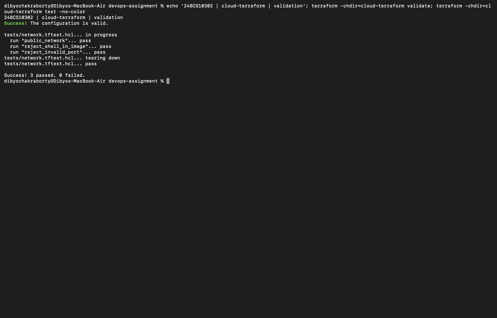
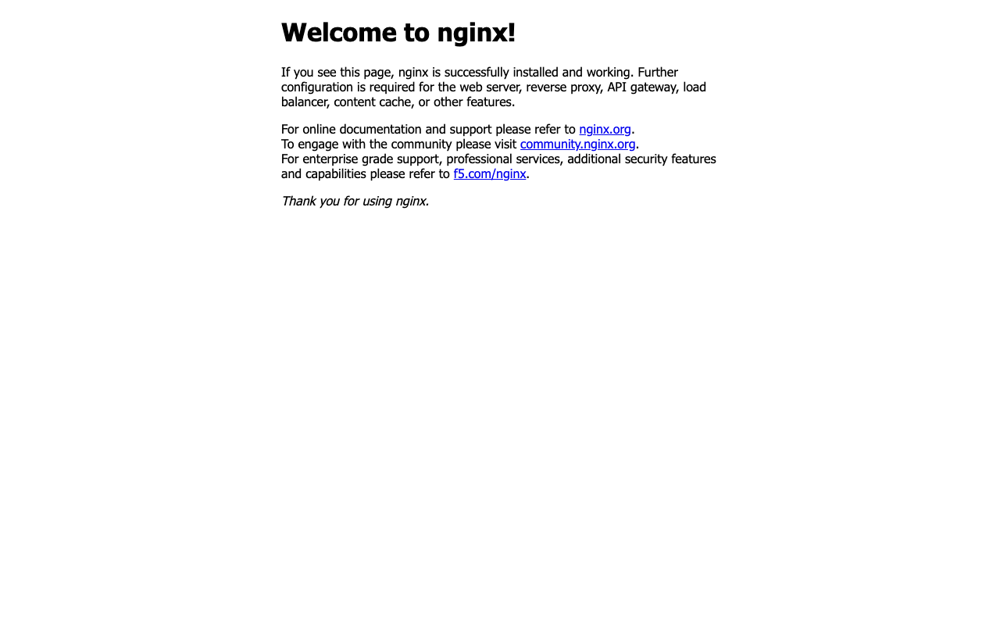
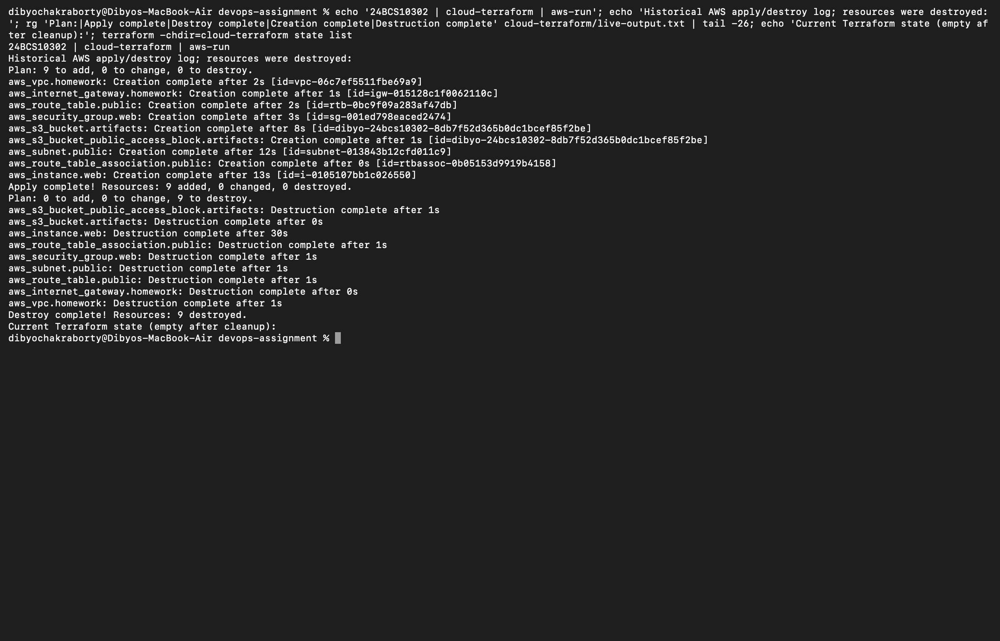

# Session 19 — Cloud and Terraform in Action

Dibyo Chakraborty · 24BCS10302

Terraform provisions a VPC, public subnet, internet gateway, default route and association, HTTP/HTTPS security group, a small EC2 Docker host, and a private S3 bucket. No SSH or IAM administrator role is provisioned. The instance uses IMDSv2 and encrypted root storage. The default container is nginx; the final project reuses this module with its own image.

```text
Internet → internet gateway → public subnet (10.0.1.0/24)
                               └─ EC2 :80 → Docker container
VPC: 10.0.0.0/16                Security group: TCP 80/443
S3: private artifact bucket (separate regional service)
```

The public route references the gateway; the subnet and security group reference the VPC. EC2 depends on the subnet route association so package installation has a path to the internet. S3 is independent. Terraform derives ordering from these dependencies and reverses it during destruction. Port 443 is permitted for the exercise, but the demo serves HTTP only; no TLS certificate is configured.

## Run and clean up

```bash
cd cloud-terraform
export AWS_PROFILE=your-lab-profile
aws sts get-caller-identity
terraform init
terraform fmt -check
terraform validate
terraform test
terraform plan -out=lab.tfplan
terraform apply lab.tfplan
terraform state list
terraform output
# Allow cloud-init a few minutes to install Docker and pull the image.
curl --fail "$(terraform output -raw web_url)"
terraform plan -destroy
terraform destroy
terraform state list
```

EC2, root storage and public IPv4 can incur charges. Destroy the lab after verifying it. A nonempty bucket intentionally prevents deletion; review and remove only lab objects before retrying cleanup. State must be preserved locally until destruction succeeds and must never be committed.

## Validation

`terraform test` checks the public subnet, route and HTTP/HTTPS-only ingress with a mocked provider. See `validation.txt` for actual command results and whether live AWS execution was possible. Mocked tests do not establish EC2 boot success or AWS permissions.



After AWS reauthentication, all nine resources were applied, state and outputs inspected, the private bucket checked with `head-bucket`, and nginx returned HTTP 200 on the EC2 public address. [Terraform transcript](live-output.txt) and [HTTP output](http-output.txt) record the run and cleanup.



All nine resources were destroyed after validation and the local state list was empty.

Direct Mac Terminal capture below displays the explicitly labelled historical apply/destroy log and a fresh empty-state check; AWS resources were not recreated for the screenshot.



Reference: [AWS VPC guide](https://docs.aws.amazon.com/vpc/latest/userguide/what-is-amazon-vpc.html), [EC2 guide](https://docs.aws.amazon.com/AWSEC2/latest/UserGuide/concepts.html).
