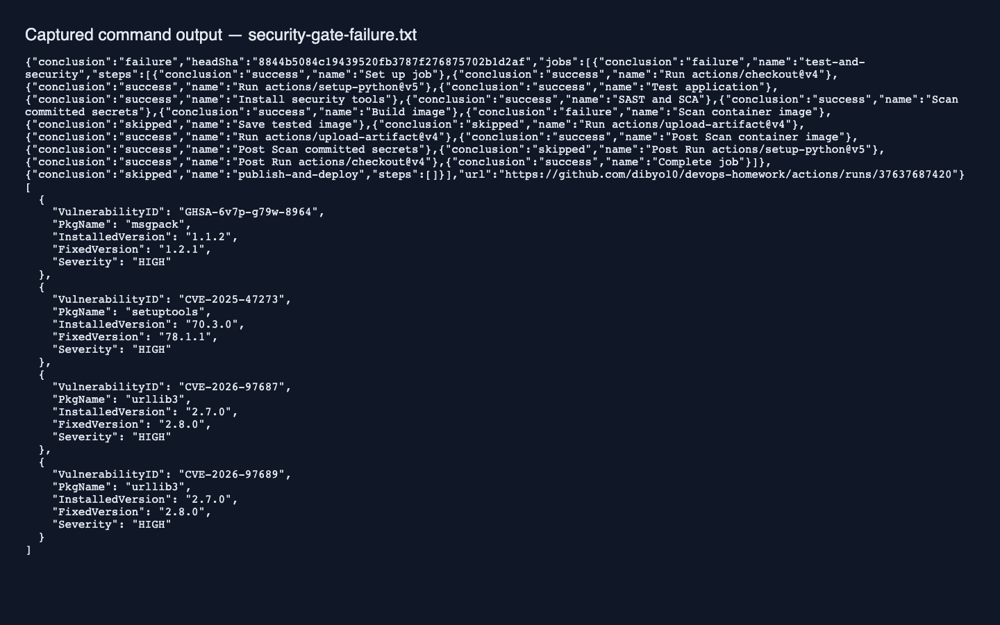
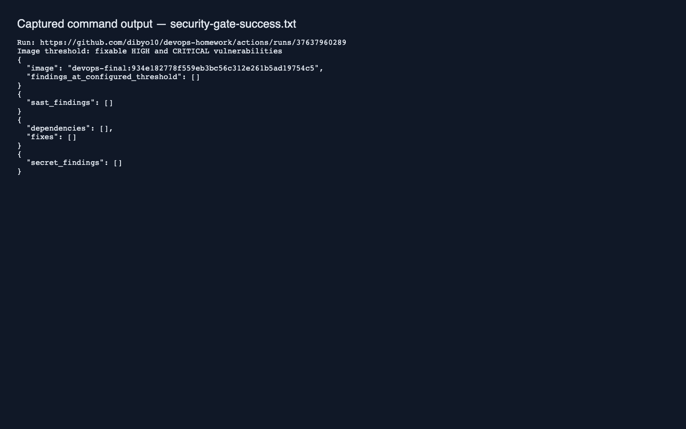

# Session 17: DevSecOps

Student: Dibyo Chakraborty, 24BCS10302.

The executable [pipeline](../.github/workflows/devops.yml) integrates these gates before a commit-tagged image can reach GHCR or Kubernetes:

| Gate | Tool | Stops publication on |
| --- | --- | --- |
| Tests | Python unittest | Failing application behavior |
| SAST | Bandit | Reported Python security issues |
| SCA | pip-audit | Vulnerable runtime dependencies |
| Secrets | Trivy filesystem scanner | Detected committed secrets |
| Image | Trivy | Fixable HIGH/CRITICAL image vulnerabilities |

SAST inspects source without running it; SCA checks dependencies against vulnerability advisories. Secret scanning detects credential patterns; image scanning checks packaged OS and language components. These checks complement one another and do not prove an application is secure.

See [security implementation and limits](../final-devops-project/security/README.md). Reports are uploaded even when a gate fails. GHCR uses GitHub's scoped temporary token; no external registry password is necessary. The pipeline deploys only after gates succeed, then checks the Kubernetes rollout and HTTP health endpoint.

## Observed gate failure and remediation

[Run 37637687420](https://github.com/dibyo10/devops-homework/actions/runs/37637687420) passed tests, SAST, SCA, and secret scanning, but Trivy rejected HIGH vulnerabilities in packaging tools bundled in the base image. The dependent publication/deployment job was skipped. The runtime needs no package installer, so the Dockerfile removes pip and its ensurepip bootstrap bundle. No CVE suppression or gate weakening was used.

The [captured report](security-gate-failure.txt) identifies the affected msgpack, setuptools, and urllib3 versions. The screenshot renders that actual command output.

After remediation, [run 37637960289](https://github.com/dibyo10/devops-homework/actions/runs/37637960289) passed every gate and published/deployed successfully. [Selected fields from the downloaded scan artifacts](security-gate-success.txt) show zero findings at the configured image threshold, no Bandit findings, no runtime dependencies, and no detected secrets.

