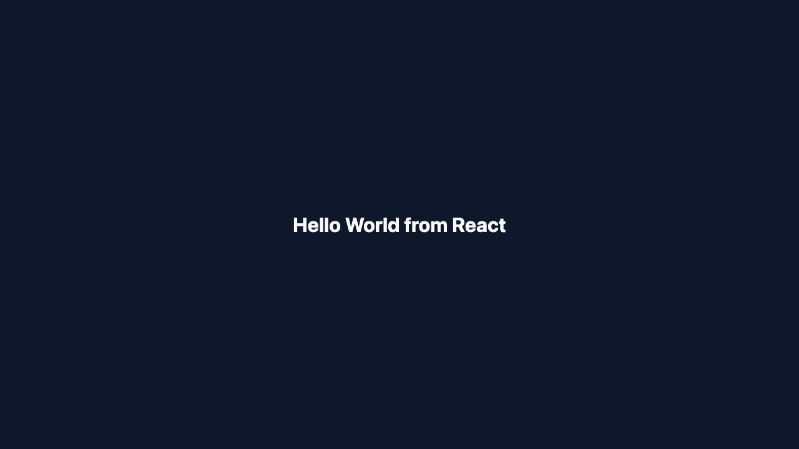

# Docker Hello World applications

Six separate applications and Dockerfiles are provided in the exact requested folders.

| Application | Container port | Host URL with Compose |
| --- | ---: | --- |
| Node.js | 3000 | http://localhost:3000 |
| Python | 5000 | http://localhost:5001 |
| Java | 8080 | http://localhost:8082 |
| Apache | 80 | http://localhost:8083 |
| React | 80 | http://localhost:8084 |
| Nginx | 80 | http://localhost:8085 |

Build and run all applications:

```bash
docker compose -f docker-apps/compose.yaml up --build -d
curl http://localhost:3000
curl http://localhost:5001
curl http://localhost:8082
curl http://localhost:8083
curl http://localhost:8084
curl http://localhost:8085
docker compose -f docker-apps/compose.yaml ps
docker compose -f docker-apps/compose.yaml down
```

Observed on 2 September 2026:

```text
3000 -> Hello World from Node.js
5001 -> Hello World from Python
8082 -> Hello World from Java
8083 -> Hello World from Apache
8084 -> Hello World from React
8085 -> Hello World from Nginx
```

All six containers reported `Up` with their expected port mappings.

## Rendered-page evidence

| Node.js | Python | Java |
| --- | --- | --- |
|  |  |  |

| Apache | React | Nginx |
| --- | --- | --- |
|  |  |  |

Each application can also be built independently, for example:

```bash
docker build -t homework-nodejs docker-apps/nodejs-app
docker run --rm -p 3000:3000 homework-nodejs
```
