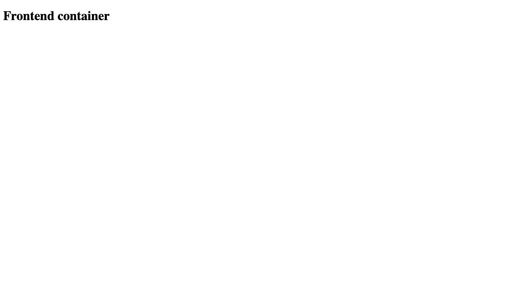

# Docker networking and volumes

## 1. Three-container networking

The Compose topology creates three networks. The frontend shares `frontend-network` with the backend. The backend shares `backend-network` with MySQL. The database also has a separate `database-network`. The backend is attached to exactly two networks as required.

```text
frontend -- frontend-network -- backend -- backend-network -- database
                                                           |
                                                    database-network
```

Run and test:

```bash
docker compose -f docker-networking/compose.yaml up -d
docker compose -f docker-networking/compose.yaml ps

# Frontend can resolve and reach backend on their shared network
docker exec homework-frontend wget -qO- http://homework-backend

# Backend can resolve and reach the database TCP port on their shared network
docker exec homework-backend nc -vz homework-database 3306

# Frontend cannot resolve the isolated database service
docker exec homework-frontend nslookup homework-database

docker network inspect devops-assignment_frontend-network
docker network inspect devops-assignment_backend-network
docker network inspect devops-assignment_database-network
docker compose -f docker-networking/compose.yaml down
```

Observed output:

```text
homework-backend    Up (frontend-network, backend-network)
homework-database   Up (healthy) (backend-network, database-network)
homework-frontend   Up (frontend-network)

Frontend to backend: Backend container
Backend to database: homework-database (172.19.0.2:3306) open
Frontend to database: NXDOMAIN
```

The successful shared-network probes and failed cross-network DNS lookup verify both connectivity and isolation.



The default password in Compose is strictly for this disposable local exercise. Set `MYSQL_ROOT_PASSWORD` in the shell for any less temporary use.

## 2. Host network

Docker Hub's official Apache HTTP Server image is named `httpd`:

```bash
docker pull httpd:2.4-alpine
docker run -d --name homework-host-apache --network host httpd:2.4-alpine
curl http://localhost:80
docker rm -f homework-host-apache
```

On native Linux, host mode puts the container directly in the host network namespace and Apache is available on port 80 without `-p`. Docker Desktop requires host networking to be enabled in Settings and implements it through its Linux VM.

Observed after temporarily enabling that Docker Desktop setting and restarting:

```text
HTTP status: 200
Mode=host Ports={}
```

The empty `Ports` map verifies that no `-p` mapping was used. The original Docker Desktop setting was restored after this test.


## 3. Bind mount

The starting page in `bind-mount-site/index.html` contains `Hello students`.

```bash
docker run -d --name homework-bind-nginx \
  -p 8086:80 \
  --mount type=bind,source="$(pwd)/docker-networking/bind-mount-site",target=/usr/share/nginx/html,readonly \
  nginx:1.29-alpine

curl http://localhost:8086
# Edit docker-networking/bind-mount-site/index.html and save it.
curl http://localhost:8086
# The second response changes without a restart.
docker rm -f homework-bind-nginx
```

A bind mount maps a host path into a container. Nginx reads the host file for each request, so saved host changes are immediately visible.

Observed without restarting the container:

```text
Container ID before edit: 73682d28b193
Response before edit: Hello students
Container ID after edit:  73682d28b193
Response after edit:  Hello students - bind mount updated
Restart count: 0
```

| Before editing the bind-mounted file | After editing the same file |
| --- | --- |
|  |  |


## 4. Overlay network research

An overlay network is a virtual Layer 2 network built over an existing routed Layer 3 network. Docker uses VXLAN encapsulation so containers on different Docker hosts appear to share one subnet.

In Docker Swarm, managers maintain network membership and service discovery, while each participating node creates a VXLAN interface. Container packets are encapsulated in UDP, cross the physical network between hosts, then are decapsulated for the destination container. Swarm overlay traffic uses TCP/UDP 7946 for node discovery and UDP 4789 for the data path. `--opt encrypted` adds IPsec encryption to the overlay data path.

Typical use cases include multi-host microservices, internal service discovery, and keeping application traffic separate from the physical addressing scheme. Operational concerns include MTU overhead, firewall ports, encryption cost, observability, and ensuring only intended services attach to each network.

Example on a Swarm manager:

```bash
docker swarm init --advertise-addr MANAGER_IP
docker network create --driver overlay --attachable app-overlay
docker service create --name web --network app-overlay --replicas 3 nginx:1.29-alpine
docker network inspect app-overlay
```
