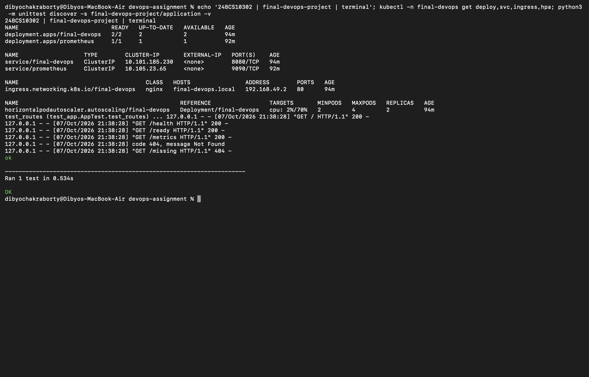
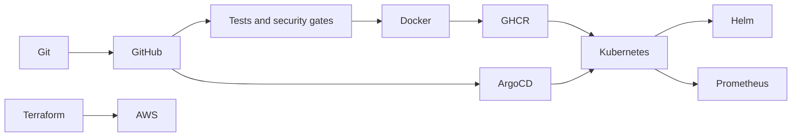
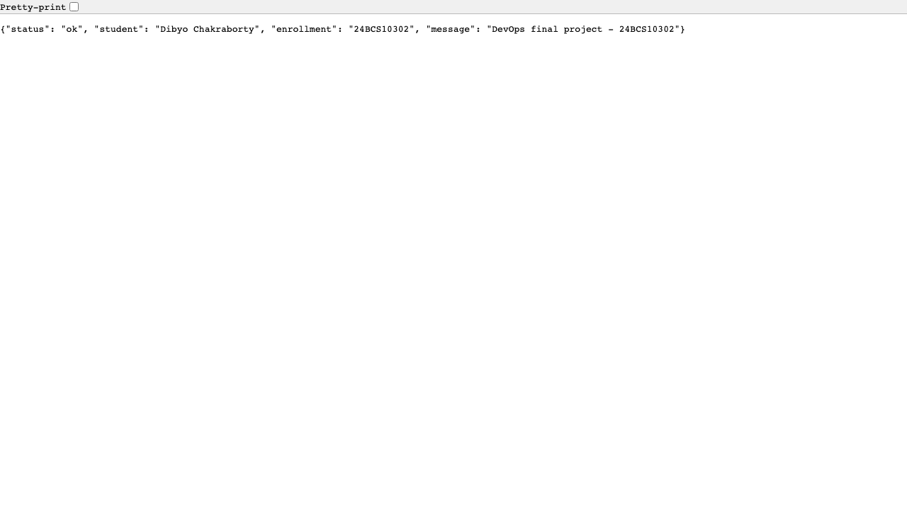

# Session 21: Final DevOps project

Fresh deployment and application test checks, captured directly from macOS Terminal:



Dibyo Chakraborty · 24BCS10302

A small Python HTTP application connects the complete delivery path. It returns student identity and configuration as JSON, exposes health/readiness probes and Prometheus uptime metrics, and writes request logs to stdout/stderr. It uses only the Python standard library.



## Application and Docker

```bash
python3 -m unittest discover -s application -v
python3 application/app.py
# In another terminal:
curl http://127.0.0.1:8080/health
docker build -f docker/Dockerfile -t devops-final:local .
docker run --rm -p 127.0.0.1:8088:8080 devops-final:local
# Alternatively:
docker compose -f docker/compose.yaml up -d --build
curl http://127.0.0.1:8088/ready
docker compose -f docker/compose.yaml down
```

## Kubernetes and Helm

```bash
minikube -p devops-homework image load devops-final:local
helm upgrade --install final-devops ./helm --namespace final-devops --create-namespace --wait
kubectl port-forward -n final-devops svc/final-devops 8088:8080
```

The chart includes two replicas, Service, ConfigMap, demonstration Secret, nginx Ingress, CPU HPA, resource requests/limits, and HTTP probes. Ingress and HPA require their controllers. No storage is required by this stateless app; persistent storage is demonstrated in the Kubernetes assignment. [Raw manifests](kubernetes/) are generated from this chart.

## Terraform infrastructure

See [`terraform/`](terraform/) for the cloud infrastructure implementation and its actual validation/deployment status. Cloud provisioning is separate from the temporary CI Kubernetes cluster.

## CI/CD and DevSecOps

The [root GitHub workflow](../.github/workflows/devops.yml) tests the application, runs Bandit/pip-audit/Trivy gates, builds an image, publishes it to GHCR using a commit SHA tag, pulls the published image, loads it into kind, deploys with Helm, and checks HTTP health. Pull requests never publish. The cluster exists only during the run. [Security details](security/) explain gate thresholds and credential handling.

## Monitoring and GitOps

`/metrics` exports `app_uptime_seconds`, `process_cpu_seconds_total`, and `process_peak_resident_memory_bytes`. The memory metric is peak process RSS; `kubectl top pods` gives current container CPU/memory from metrics-server. Prometheus generates `up` for scrape health. [Monitoring configuration](monitoring/) includes an application-down alert. Request logs are available with `kubectl logs -n final-devops deployment/final-devops`.

The [Argo CD Application](gitops/application.yaml) reconciles this repository's Helm chart and restores drift with self-healing. The classroom configuration uses a locally loaded image; for a remote cluster commit a published GHCR SHA tag and configure pull access if the package is private. See the monitoring/GitOps assignment for the live reconciliation exercise.

## Troubleshooting and screenshots

[Final troubleshooting challenge](troubleshooting/README.md) deliberately introduces multiple issues, records diagnosis, repairs the resources, and verifies HTTP behavior in a separate namespace.



[Successful GitHub Actions run](https://github.com/dibyo10/devops-homework/actions/runs/37637960289) passed tests, security gates, registry publication, Kubernetes rollout, and HTTP checks. [Pipeline screenshots and output](../cicd-github-actions/README.md) and [live monitoring/GitOps evidence](../monitoring-gitops/README.md) document the remaining integrations.

## Lessons learned

- GitHub discovers workflows only at the repository root, even when the project lives in a subdirectory.
- A successful image build is insufficient: verify scan gates, publication, rollout, and HTTP behavior independently.
- HPA, ingress, and GitOps resources need controllers; YAML acceptance alone does not demonstrate their behavior.
- Local kind evidence and cloud provisioning are distinct outcomes.
