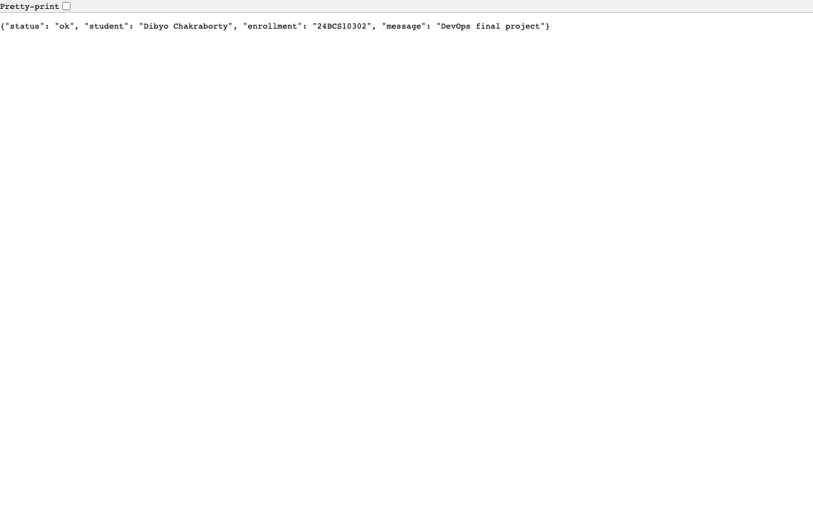
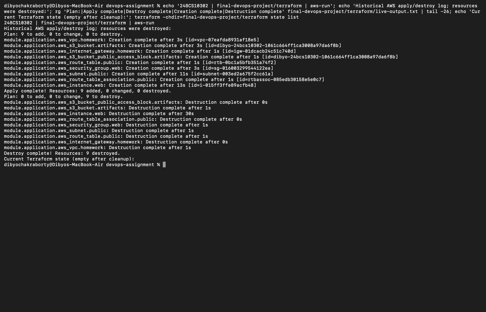
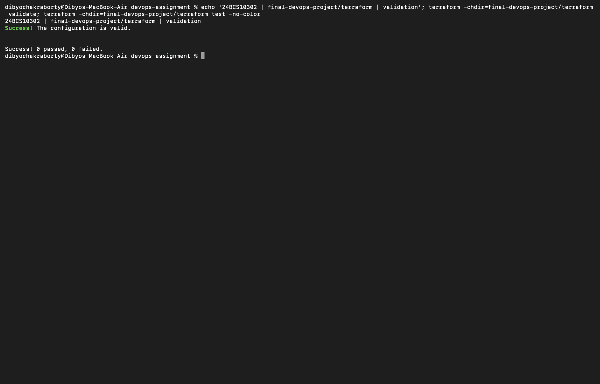

# Final project — AWS infrastructure

Reuses the [Session 19 infrastructure](../../cloud-terraform/) with the final project's container on port 8080, exposed on HTTP port 80. The root module creates its own resources and state; it does not adopt a previous lab deployment. This is a Docker-on-EC2 deployment; the Kubernetes manifests are a separate deployment target.

After the workflow publishes an image, confirm its GHCR package is public so EC2 can pull without embedding credentials. Supply the actual immutable commit tag:

```bash
export AWS_PROFILE=your-lab-profile
export TF_VAR_container_image=ghcr.io/dibyo10/devops-homework:YOUR_COMMIT_SHA
terraform init
terraform validate
terraform plan -out=application.tfplan
terraform apply application.tfplan
# Wait for cloud-init and image pull to finish.
curl --fail "$(terraform output -raw web_url)/health"
terraform destroy
```

The instance and public IPv4 incur charges until cleanup. Keep state private and preserve it until destroy completes. The shared module's local validation is recorded in [cloud-terraform/validation.txt](../../cloud-terraform/validation.txt).

## Live AWS verification

On 2026-10-07, anonymous GHCR access to image `934e182778f559eb3bc56c312e261b5ad19754c5` returned HTTP 200. Terraform created nine resources and EC2 pulled and ran that image. `/health` returned HTTP 200 with Dibyo Chakraborty and enrollment 24BCS10302. The S3 bucket passed `head-bucket`; state and outputs were inspected. [Terraform and cleanup transcript](live-output.txt), [health check](http-output.txt).



All nine resources were destroyed after verification. AWS reports the EC2 instance terminated and Terraform state is empty.

Direct Mac Terminal capture below displays the explicitly labelled historical apply/destroy log and a fresh empty-state check; AWS resources were not recreated for the screenshot.



