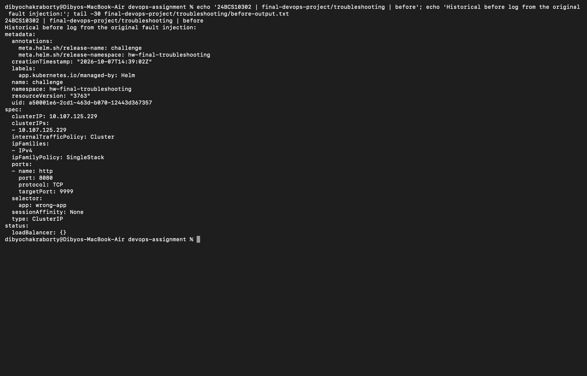
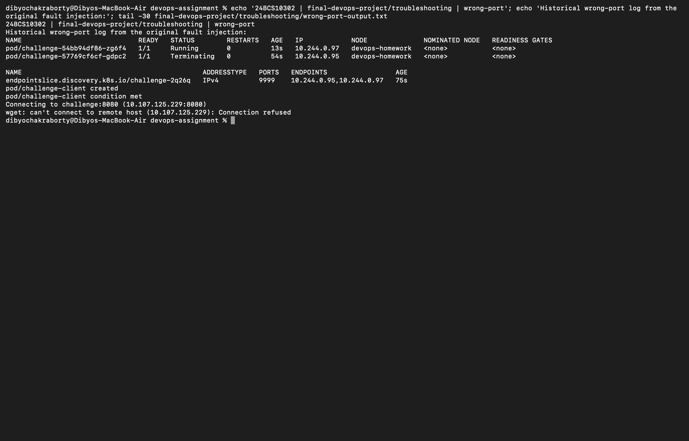
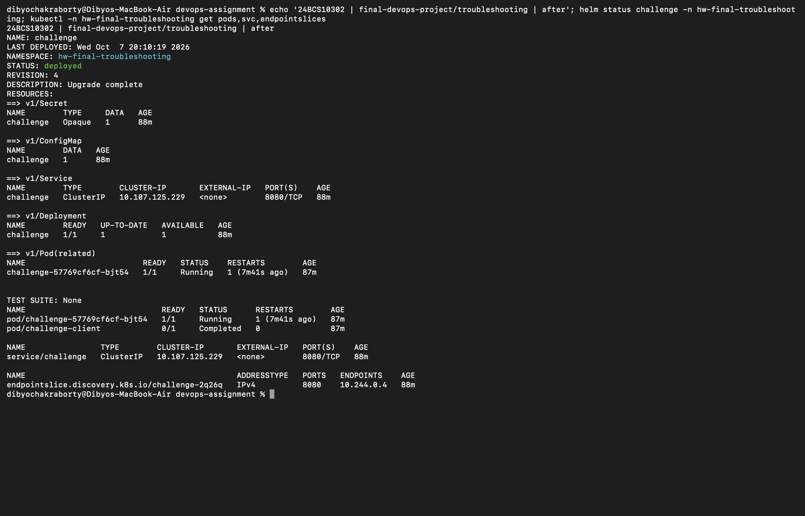

# Final challenge: diagnose a broken Helm deployment

Dibyo Chakraborty · 24BCS10302

This exercise reuses the final project's Helm chart as release `challenge` in the separate namespace `hw-final-troubleshooting`. It does not modify the working final-project release.

Run `bash final-devops-project/troubleshooting/run.sh` after loading `devops-final:local` into the `devops-homework` Minikube profile. The script deliberately introduces three faults, diagnoses them in stages, and reinstalls the chart's correct settings.

| Fault | Evidence | Root cause and fix |
| --- | --- | --- |
| Missing application image | New Pod events show ErrImageNeverPull | The intentionally missing tag is not present and pull policy Never prevents pulling. Restore the loaded devops-final:local image. |
| Incorrect Service selector | Service has app=wrong-app and no matching backends | Pods have app=challenge. Restore that selector. |
| Incorrect target port | Ready backend exists but wget fails | Service forwards to 9999 while the container listens on 8080. Restore named targetPort http through Helm upgrade. |

Fixing only the image does not restore connectivity. Fixing the selector next exposes the wrong-port failure. Finally, Helm upgrade restores the declared configuration; a client requests `/health`, and application logs confirm HTTP 200.

During a rolling update, an old healthy Pod can remain while the new Pod fails to start. In this captured rerun, `kubectl logs deployment/challenge` selected that old Pod and showed successful historical requests. Those logs do not prove the new revision or Service is healthy; Pod events and EndpointSlices identify the actual faults.

The script checks the expected failed HTTP attempt and the final successful client completion. It uses only public demo configuration and already-built local images.

This run uses Helm 4 server-side apply. The deliberate kubectl patch owns the changed Service port, so an ordinary upgrade initially failed with a field ownership conflict. The scoped `--force-conflicts` option lets this challenge release reclaim the deliberately changed fields. Helm history retains that failed attempt; the later deployed revision proves recovery.

[Before output](before-output.txt) · [Wrong-port output](wrong-port-output.txt) · [After output](after-output.txt)

Screenshots directly capture macOS Terminal. The before/wrong-port screenshots explicitly display historical fault-injection logs; the after screenshot shows a fresh live check of the repaired release. Cleanup only this challenge with `helm --kube-context devops-homework uninstall challenge -n hw-final-troubleshooting` and `kubectl --context devops-homework delete namespace hw-final-troubleshooting`.
