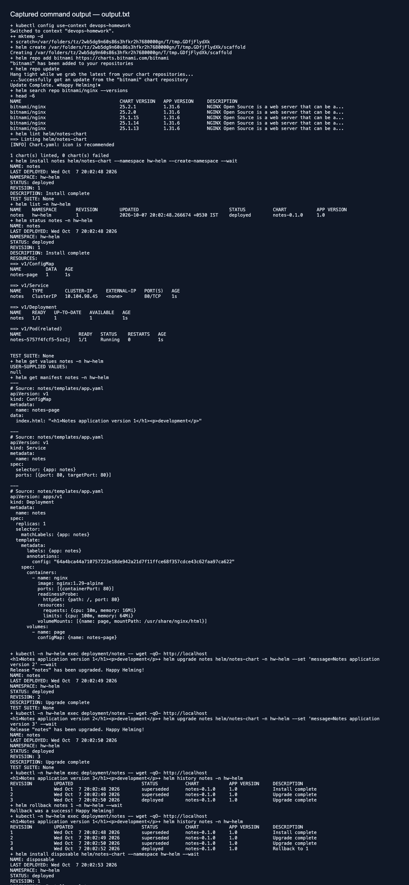
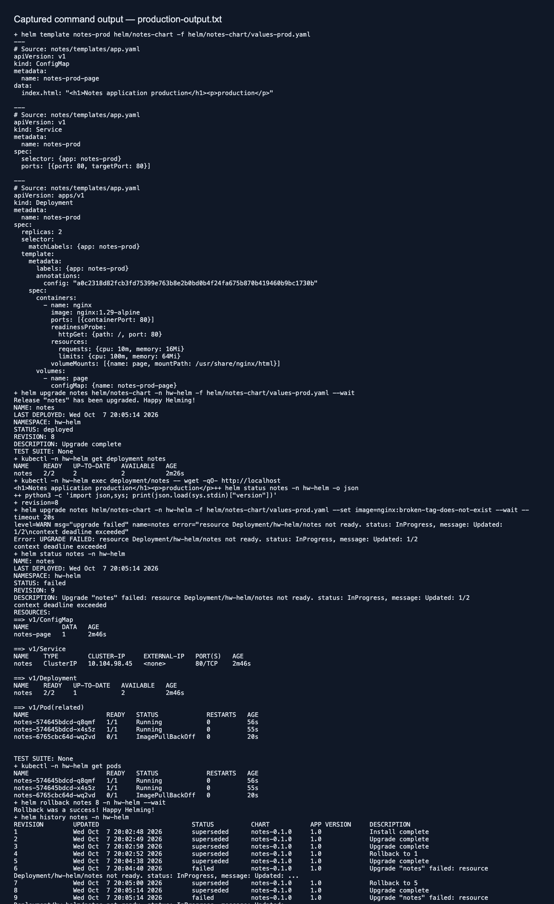

# Session 15 — Helm

Dibyo Chakraborty · 24BCS10302

Helm packages Kubernetes resources into charts and tracks installed releases. A chart is the reusable package; a release is an installation in a namespace; a repository distributes charts. `Chart.yaml` holds package metadata, `values.yaml` supplies defaults, and templates turn values into manifests.

## Task 1: commands

From the repository root, with the `devops-homework` Kubernetes context available:

```bash
bash helm/run.sh
```

This demonstrates repository add/update/search, `helm create`, lint, install, list, status, get values/manifest, upgrade, history, rollback and uninstall. The disposable release demonstrates uninstall while leaving the notes release available for inspection. [Actual output](output.txt).

`helm template notes helm/notes-chart` renders locally without installing. `--set message=...` overrides an individual value; `-f helm/notes-chart/values-prod.yaml` applies the production values file. Chart `version` tracks the package while `appVersion` describes the application version.



## Task 2: rollback

The first script installs version 1, upgrades the page to version 2 and then version 3, and rolls back to revision 1. Helm records the rollback as a new revision 4. HTTP checks after every change verify the visible page; a rollback does not erase release history.


## Task 3: configurable notes mini project

`notes-chart/` deploys a small nginx notes landing page through a Deployment, ConfigMap and Service. Values configure the image, page message, environment and replica count. Production values use two replicas. The ConfigMap content checksum in the pod annotation triggers rollout when the message changes.

```bash
bash helm/verify-production.sh
kubectl -n hw-helm port-forward service/notes 18188:80
# Open http://127.0.0.1:18188
```

The production script renders the chart, upgrades with the production values, attempts a deliberately nonexistent image, confirms the failed upgrade, then restores the previous working revision and checks two ready replicas. [Production and failure-recovery output](production-output.txt).




Cleanup after inspection:

```bash
helm uninstall notes -n hw-helm
```
