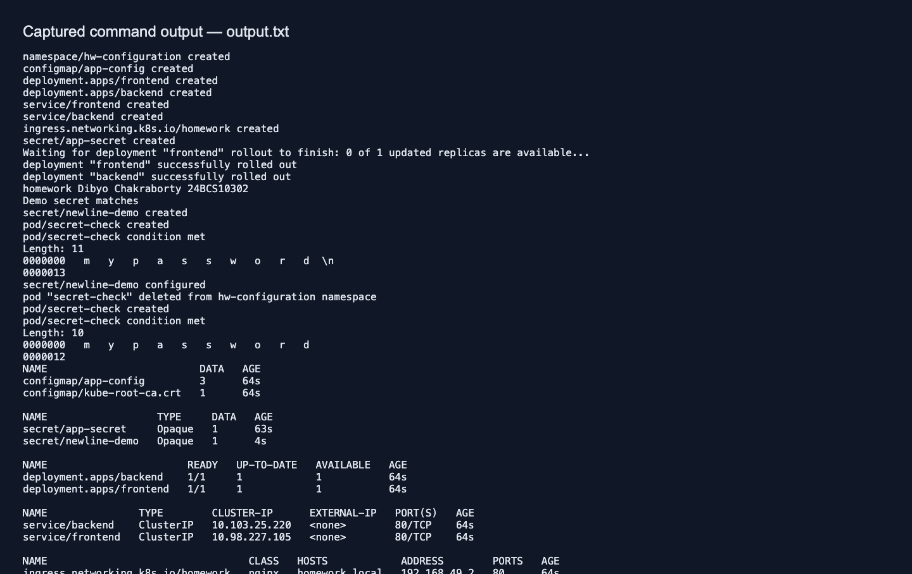
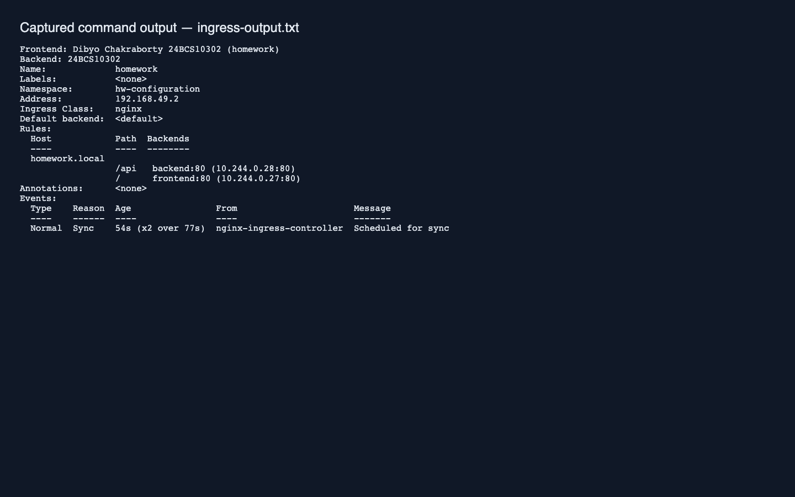

# Session 12: ConfigMaps, Secrets and Ingress

Dibyo Chakraborty · 24BCS10302

## ConfigMap and Secret

`lab.yaml` stores APP_ENV, STUDENT and ENROLLMENT in a ConfigMap. The frontend consumes it with envFrom. `secret.example.yaml` contains only a visibly fake classroom password and injects DB_PASSWORD.

```bash
bash kubernetes-configuration/verify.sh
```

The script prints configuration values and checks the secret value inside the container without printing a password. Environment variables are read at container startup; a changed ConfigMap/Secret requires a new Pod to update these variables.

Real credentials must not be committed. Base64 is encoding, not encryption; Git history retains removed values. Use a secret manager or protected deployment injection, restrict RBAC, and enable encryption at rest. The example and troubleshooting credentials in this directory are intentionally public dummy data. [Secrets documentation](https://kubernetes.io/docs/concepts/configuration/secret/).

## Ingress routing

`lab.yaml` contains frontend/backend Deployments, Services and an Ingress for `homework.local`. Path `/` routes to frontend, and `/api/` routes to backend. Both return the enrollment number.

Install a controller in the isolated Minikube profile, then forward its HTTP port:

```bash
minikube -p devops-homework addons enable ingress
kubectl -n ingress-nginx rollout status deployment/ingress-nginx-controller --timeout=180s
kubectl -n ingress-nginx port-forward service/ingress-nginx-controller 18080:80
# Separate terminal:
curl -H 'Host: homework.local' http://127.0.0.1:18080/
curl -H 'Host: homework.local' http://127.0.0.1:18080/api/
kubectl -n hw-configuration describe ingress homework
kubectl -n hw-configuration get endpointslice
```

This reaches the actual controller over a local forward, preserving host/path routing without changing the machine's hosts file.

| Ingress | Ingress controller |
| --- | --- |
| Kubernetes API object describing HTTP host/path rules | Running reverse proxy/controller that implements rules |
| Stored as a manifest | Installed as software in the cluster |
| Refers to Services and optionally TLS Secrets | Watches matching IngressClass resources and forwards requests |

Both are needed for this example: rules alone do not serve requests; a controller without these rules cannot implement the application's routing. NGINX is the lab implementation; the API is not specific to NGINX.

## Troubleshooting: extra newline in Secret

The broken Secret encodes `mypassword\n`, 11 bytes, instead of `mypassword`, 10 bytes. The verification script applies broken then fixed YAML, recreating the consumer Pod each time. Its logs show byte length and `od -c` output before and after.

```bash
printf 'mypassword\n' | base64
printf %s mypassword | base64
kubectl -n hw-configuration describe pod secret-check
kubectl -n hw-configuration logs secret-check
```

The source of the newline is ordinary `echo`, not base64. Fix with `printf %s` when encoding, or `stringData` as in `fixed-secret.yaml`. Recreating the Pod matters because env-injected Secrets do not refresh in existing processes. A base64 suffix is not a reliable general-purpose newline detector; inspect decoded bytes.

Cleanup: `kubectl delete namespace hw-configuration`.

## Captured run

[ConfigMap, Secret and before/after output](output.txt) shows the injected student details, successful dummy-secret comparison, broken value length 11 with newline, and fixed length 10 without newline. [Ingress output](ingress-output.txt) shows both routes returning their distinct frontend/backend responses through the controller.




Screenshots render saved actual command transcripts using Playwright.
