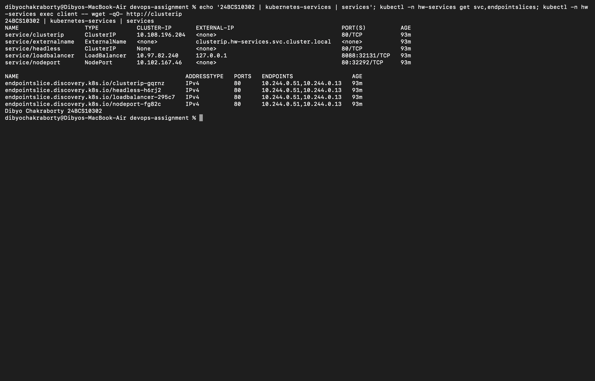
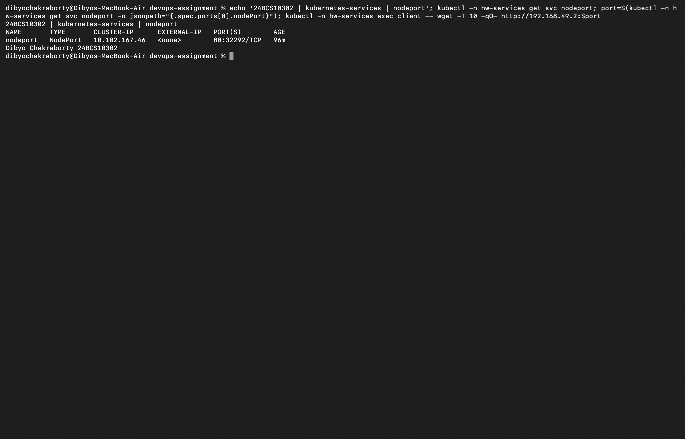
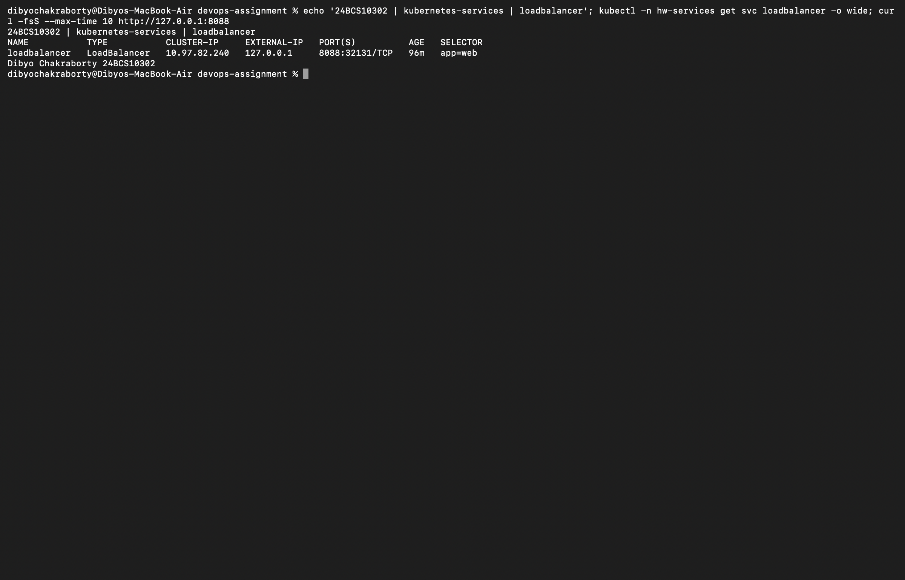

# Session 11: Networking and Services

Dibyo Chakraborty · 24BCS10302

`lab.yaml` creates two NGINX StatefulSet Pods, a BusyBox client and all five requested Service demonstrations in `hw-services`.

```bash
bash kubernetes-services/verify.sh
```

| Exercise | Address behavior | Connectivity |
| --- | --- | --- |
| ClusterIP | Stable virtual cluster IP | Client requests http://clusterip |
| NodePort | ClusterIP plus allocated port on nodes | Internal client check plus node-IP:nodePort |
| LoadBalancer | ClusterIP plus external load balancer integration | Internal client check; external address requires a provider/tunnel |
| ExternalName | DNS CNAME only, no proxy or assigned IP | Alias to clusterip.hw-services.svc.cluster.local; client resolves and requests it |
| Headless | clusterIP None; DNS returns backing Pod addresses | Client requests http://headless and resolves web-0.headless |

Headless is a Service configuration, not a fifth `spec.type` enum. ExternalName may alias any suitable DNS name; this example deliberately uses a cluster FQDN so the lab does not depend on external Internet HTTP policy.

## External access

On Minikube's Docker driver for macOS, node addresses generally are not directly reachable from the host. Run the URL/tunnel commands in separate terminals and keep them running:

```bash
minikube -p devops-homework service nodeport -n hw-services --url
minikube -p devops-homework tunnel
kubectl -n hw-services get service loadbalancer -w
```

Use curl with the emitted NodePort URL or LoadBalancer external address. A successful ClusterIP request alone does not demonstrate external load balancer provisioning. A Pending external address means no load balancer implementation has assigned one yet.

## Object comparison

| Aspect | ReplicaSet | Deployment |
| --- | --- | --- |
| Purpose | Maintain a desired count of matching Pods | Manage ReplicaSets and application versions |
| Pod management | Creates replacement Pods after deletion/failure | Owns ReplicaSets which own Pods |
| Scaling | Change replicas or kubectl scale rs | Change replicas or kubectl scale deployment |
| Updates | Template edits do not replace existing Pods | RollingUpdate or Recreate, rollout history and rollback |

Deployment → ReplicaSet → Pod is the ownership chain. A template update creates a new ReplicaSet.

| Aspect | Deployment | DaemonSet | StatefulSet |
| --- | --- | --- | --- |
| Use | Stateless replicas | Per-node agents | Stable identity and state |
| Creation | Interchangeable Pod names | One Pod per eligible node | Ordinal names; ordered by default |
| Scaling | Desired replica count | Eligible node count | Desired replica count |
| Network | Usually normal Service | Pod/node network; Service optional | Governing headless Service for stable Pod DNS |
| Storage | Optional volumes/PVCs | Often node-local mounts | Per-Pod claim templates when storage is needed |
| Example | HTTP frontend | Log collector | Database cluster |

A ReplicaSet maintains Pod count, but does not provide network addressing. A Service selects suitable Pods and exposes a stable discovery target. DNS resolves a normal Service to its ClusterIP; the cluster's Service dataplane forwards connections to ready EndpointSlice backends. kube-proxy commonly programs this forwarding, though some network implementations replace it.

See [FQDN](fqdn/README.md) and [CoreDNS](coredns/README.md). Cleanup: `kubectl delete namespace hw-services`.

## Captured run

[Full output](output.txt) includes all five Services, successful internal HTTP responses, the ExternalName CNAME, headless Pod addresses, the StatefulSet Pod FQDN, resolver settings and the actual Corefile.

NodePort was reached from macOS through the URL emitted by Minikube. LoadBalancer received 127.0.0.1 through `minikube tunnel` and was successfully reached on port 8088. Port 8088 avoids privileged host port 80. Both local tunnels must remain running to repeat host access.

[NodePort output](nodeport-output.txt) · [LoadBalancer output](loadbalancer-output.txt)





Screenshots directly capture macOS Terminal running fresh Service, NodePort and host-side LoadBalancer tunnel requests.
