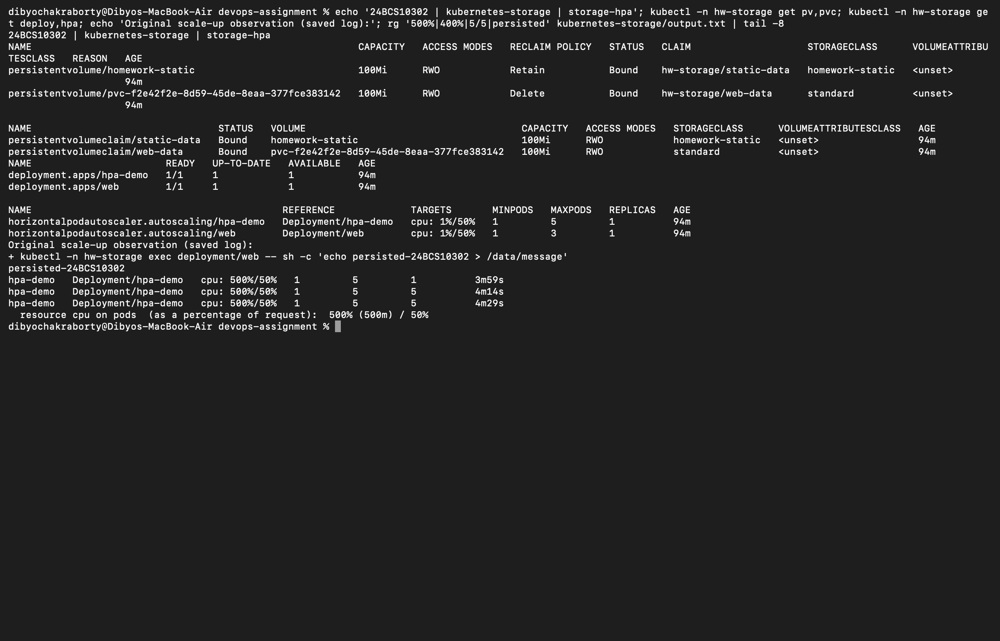
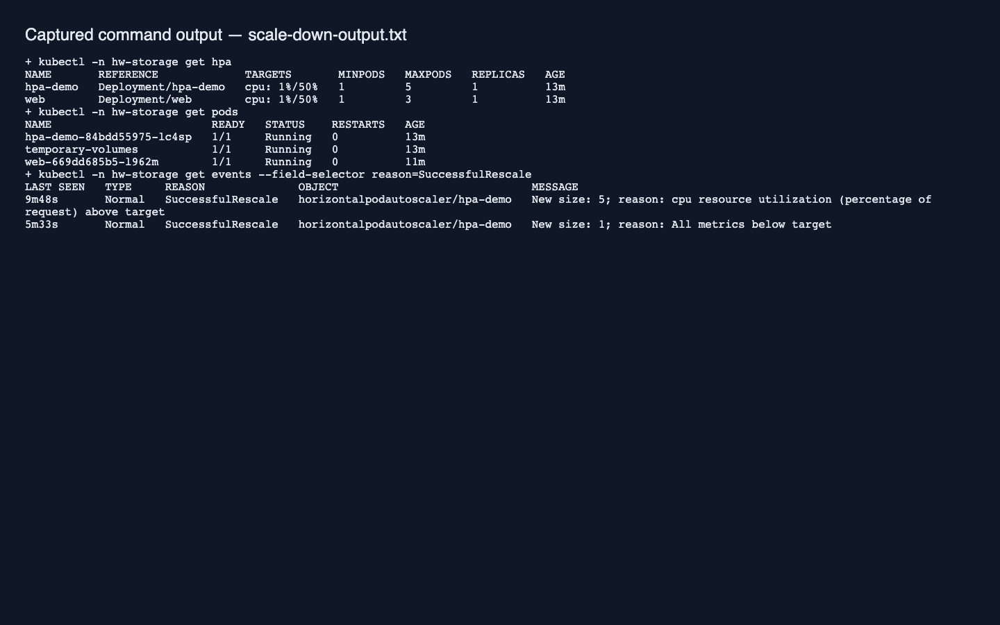

# Session 13 — Storage, HPA and probes

Dibyo Chakraborty · 24BCS10302

[Volume notes](01-kubernetes-volumes/README.md) cover all six required storage concepts. Manifests contain the temporary-volume exercise, static PV/PVC, dynamically provisioned PVC, load generator, and the Nginx storage mini-project adapted from the reference assignment.

## Run

```bash
kubectl apply -f kubernetes-storage/namespace.yaml
kubectl apply -f kubernetes-storage/volumes.yaml
kubectl apply -f kubernetes-storage/mini-project.yaml
minikube -p devops-homework addons enable metrics-server
kubectl apply -f kubernetes-storage/hpa.yml
kubectl -n hw-storage rollout status deployment/hpa-demo
kubectl -n hw-storage get hpa
kubectl apply -f kubernetes-storage/load-generator.yaml
kubectl -n hw-storage get hpa --watch
kubectl -n hw-storage top pods
kubectl -n hw-storage get pods
kubectl -n hw-storage describe hpa hpa-demo
kubectl -n hw-storage delete pod load-generator
```

The official CPU-bound hpa-example makes autoscaling measurable; serving a tiny static file with Nginx may not create enough CPU demand. CPU requests are 100m, the HPA target is 50% of the request, and the maximum is five replicas. At 500m usage the original Pod showed 500% utilization, and the HPA scaled the Deployment from one to five replicas. Initial unknown metrics disappear once the metrics server and HPA have collected samples.

## Mini-project and probes

mini-project.yaml runs Nginx with a Service, PVC, HPA, resource limits, and startup/readiness/liveness probes. Startup delays the other probes until boot completes; readiness removes an unready Pod from Service traffic; liveness restarts an unhealthy container. A PVC retains application data across Pod replacement. Recreate is used for the storage deployment, matching the supplied exercise.

```bash
kubectl -n hw-storage exec deployment/web -- sh -c 'echo persisted-24BCS10302 > /data/message'
kubectl -n hw-storage rollout restart deployment/web
kubectl -n hw-storage rollout status deployment/web
kubectl -n hw-storage exec deployment/web -- cat /data/message
```

The read returned persisted-24BCS10302 after replacement. [Full recorded commands and output](output.txt).



After removing the load generator, CPU returned to 1% and the HPA reduced five replicas back to one. [Scale-down output](scale-down-output.txt).



Source: [HPA walkthrough](https://kubernetes.io/docs/tasks/run-application/horizontal-pod-autoscale-walkthrough/).
