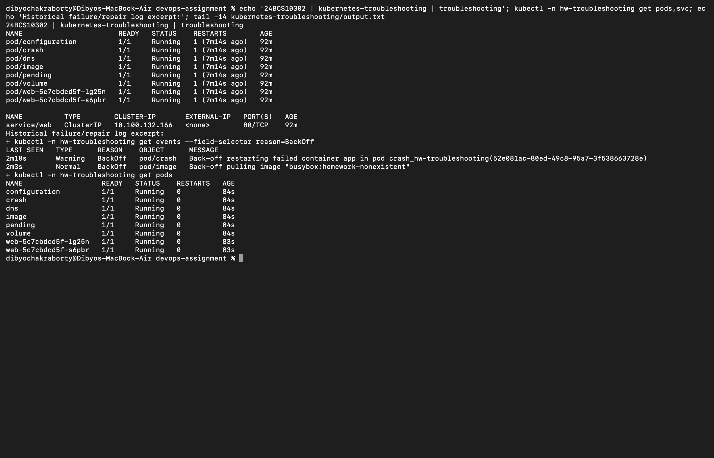

# Session 14 — Kubernetes troubleshooting

Dibyo Chakraborty · 24BCS10302

Run from the repository root: `bash kubernetes-troubleshooting/run.sh`. It deliberately breaks only resources in hw-troubleshooting. The broken/ and fixed/ manifests are valid JSON-formatted YAML; Kubernetes accepts both serializations.

## Investigation and repair

| Problem | Observed symptom and investigation | Root cause | Fix and verification |
| --- | --- | --- | --- |
| CrashLoopBackOff | get, describe and logs show repeated Error exits, restart count and BackOff events | Process deliberately exits 1 | Replace with a long-running process; Ready |
| ErrImagePull / ImagePullBackOff | describe events show missing image followed by backoff | busybox:homework-nonexistent does not exist | Use busybox:1.37; Ready |
| Pending | describe reports FailedScheduling | nodeSelector matches no node | Remove invalid selector; scheduled and Ready |
| ContainerCreating | describe reports FailedMount | ConfigMap volume source missing | Remove invalid volume for this minimal Pod; Ready |
| Configuration | CreateContainerConfigError | envFrom references nonexistent ConfigMap | Remove invalid reference; Ready |
| DNS | nslookup times out | dnsPolicy None and unreachable nameserver | Restore ClusterFirst defaults; resolves kubernetes.default.svc.cluster.local |
| Service connectivity | no EndpointSlice addresses; wget fails | Service selector app=wrong does not match Pods | Match app=web; populated endpoints |
| Pod networking / wrong port | endpoints exist but wget fails | Service targetPort81 while Nginx listens on80 | Correct targetPort80; HTTP succeeds |

The script inspects each problem before applying its repair. In production, investigate before recreating Pods; recreation alone does not repair a bad desired configuration. CrashLoopBackOff and ImagePullBackOff are displayed container waiting reasons, not Pod phases.

## Mini-project

Two Nginx replicas sit behind the web Service. We intentionally break its selector, inspect labels and EndpointSlices, then repair it. We next route to the wrong container port, capture the failed request, and restore port80. A deliberately missing image is reproduced separately. The final Service request returns the Nginx welcome page.

## Command notes

- get lists resource state; -o wide adds placement and addresses.
- describe includes configuration, conditions, scheduling failures and Events.
- logs retrieves process output; --previous retrieves the last crashed container.
- exec runs a diagnostic command inside a container.
- events lists recent cluster observations; events expire and are not permanent audit logs.
- explain reads API field documentation.
- top reports CPU/memory from metrics-server, after its first sample.
- Service selectors match Pod labels; a Service with no ready selected Pods cannot deliver requests.
- Kubernetes DNS resolves Service names to a cluster IP, a set of endpoint IPs for headless Services, or a CNAME for ExternalName.

[Commands and before/after output](output.txt). Metrics collection initially returned unavailable, then later samples were captured.

Source: [Troubleshooting applications](https://kubernetes.io/docs/tasks/debug/debug-application/).
