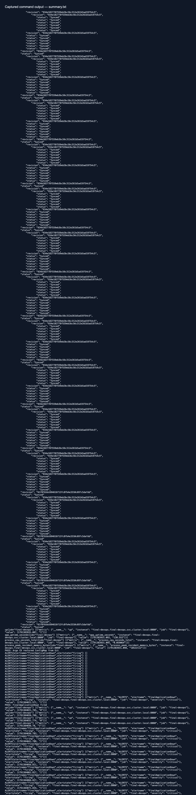
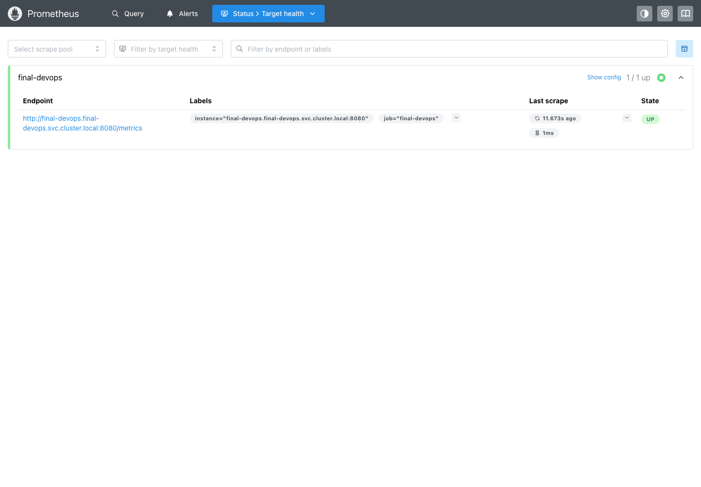
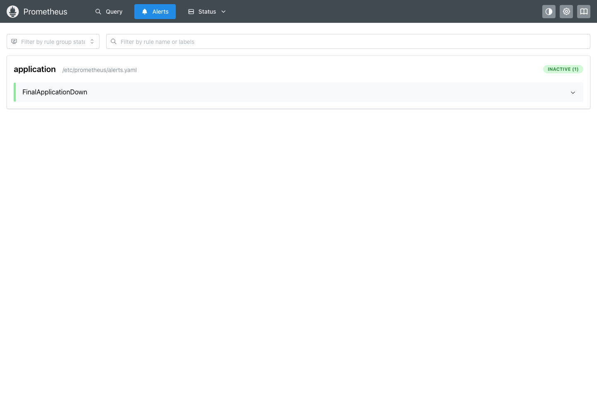
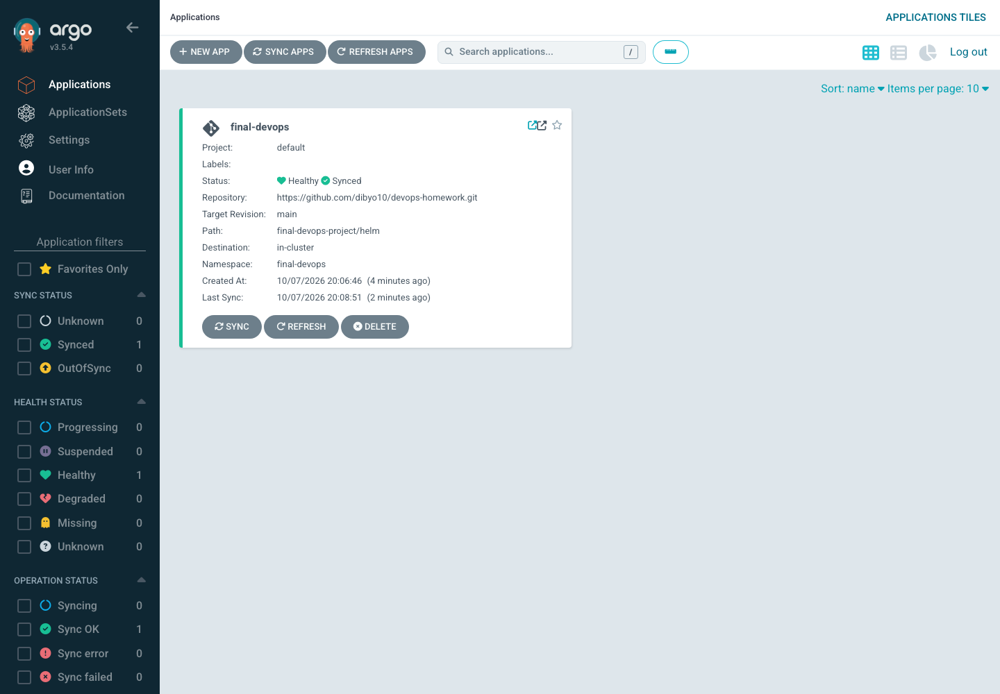

# Session 20 — Monitoring, observability and GitOps

Dibyo Chakraborty · 24BCS10302

## Concepts

Monitoring checks known signals and thresholds: is the service reachable, is memory rising, has an alert fired? Observability is the ability to investigate internal behavior from the signals a system emits, including unexpected problems.

| Signal | What it answers | Example |
| --- | --- | --- |
| Metrics | How much, how often, over what interval? | Availability, CPU time, memory, latency |
| Logs | What happened in this process? | Request path, status and error context |
| Traces | Where did a request spend time across services? | Spans connected by trace IDs |

This lab implements Prometheus metrics and container logs. Distributed tracing is explained here, not deployed: the application is a single service and does not export OpenTelemetry spans. [OpenTelemetry signals](https://opentelemetry.io/docs/concepts/signals/).

Prometheus scrapes `/metrics` every 15 seconds. The application exports uptime, cumulative process CPU seconds and peak resident memory bytes. CPU rate can be queried with `rate(process_cpu_seconds_total[2m])`; peak resident memory is a high-water mark, not current memory. `kubectl top pods -n final-devops` reports Kubernetes resource metrics separately. The single Service scrape target demonstrates reachability but does not scrape every replica independently.

`FinalApplicationDown` becomes pending when `up == 0` and fires after one minute of continuous failure. Rule evaluation timing means the visible transition may take longer than one minute. Alertmanager would group and route notifications; this lab verifies rule firing/recovery in Prometheus without sending external notifications. [Prometheus alerting](https://prometheus.io/docs/alerting/latest/overview/).

## Run

Start the [final application](../final-devops-project/) in the local `devops-homework` cluster, load `devops-final:local`, and publish its Helm chart to the repository before installing Argo CD:

```bash
bash monitoring-gitops/install.sh
kubectl -n final-devops port-forward service/prometheus 19090:9090
# In a second terminal:
python3 monitoring-gitops/verify.py
kubectl -n final-devops logs deployment/final-devops --tail=20
```

The verifier checks live metrics, waits for Argo CD to report Synced/Healthy, changes a ConfigMap and observes automatic restoration from Git. For the outage test it temporarily pauses automated sync and changes only the application Service selector, waits for the alert to fire, then restores the selector and sync policy in a `finally` block. It checks the alert clears and GitOps recovers. Do not run this deliberate outage test against a production service.

## GitOps flow

```text
GitHub main / final-devops-project/helm
    → Argo CD renders Helm values
    → compares desired and live Kubernetes state
    → syncs changes and repairs drift
    → reports synchronization and resource health
```

The [Application](../final-devops-project/gitops/application.yaml) enables pruning and self-healing. CI tests/builds the artifact; Argo CD continuously reconciles deployment configuration. A Git revert changes the desired state for a rollback. Manual edits are overwritten when self-healing is enabled. [Argo CD automated sync](https://argo-cd.readthedocs.io/en/stable/user-guide/auto_sync/).

For this local exercise, image overrides select the preloaded `devops-final:local` image. Git synchronization proves reconciliation of the chart, not a registry image promotion; use an immutable published image tag for a remote cluster.

## Recorded run

[Installation transcript](install-output.txt) and [runtime verification transcript](output.txt) record the actual cluster checks and Git revision. Screenshots remain in this project directory.








