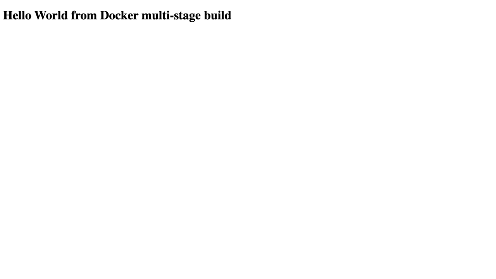

# Docker multi-stage build

## Student details

- Name: Dibyo Chakraborty
- Enrollment number: 24BCS10302

## Build and run

```bash
docker build -t homework-multistage multi-stage-build
docker run -d --name homework-multistage -p 8080:8080 homework-multistage
curl http://localhost:8080
docker ps --filter name=homework-multistage
docker rm -f homework-multistage
```

Expected page:

```text
Hello World from Docker multi-stage build
```

The build uses an Alpine content stage and copies its artifact into a separate Node.js runtime stage. The runtime listens on container and host port 8080.

## Observed evidence

```text
$ curl http://localhost:8080
Hello World from Docker multi-stage build

$ docker ps --filter name=homework-multistage
NAMES                 STATUS        PORTS
homework-multistage   Up 1 second   0.0.0.0:8080->8080/tcp, [::]:8080->8080/tcp
```


