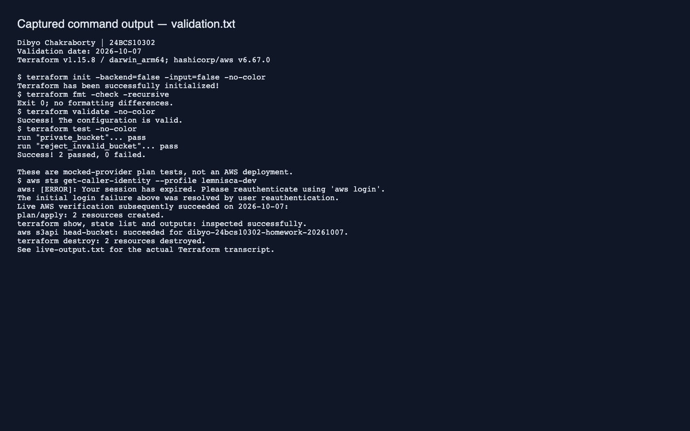
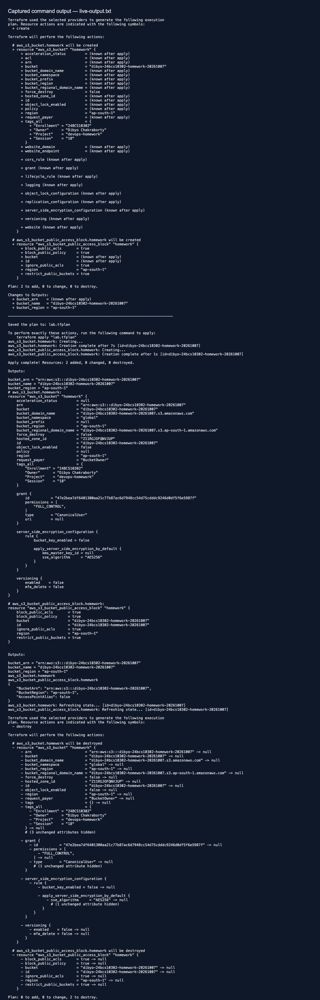

# Session 18 — Terraform S3

Dibyo Chakraborty · 24BCS10302

This configuration creates a uniquely named S3 bucket and explicitly blocks public access. AWS encrypts new S3 uploads by default. `force_destroy = false` prevents Terraform from deleting a bucket containing objects.

## Run

Use an AWS profile authorized for this lab. Terraform reads credentials from the AWS credential chain; do not put credentials in configuration or Git.

```bash
cd terraform-s3-demo
export AWS_PROFILE=your-lab-profile
# The included terraform.tfvars contains only non-secret lab settings.
# Change bucket_name if that globally unique name is already occupied.
aws sts get-caller-identity
terraform init
terraform fmt -check
terraform validate
terraform test
terraform plan -out=lab.tfplan
terraform apply lab.tfplan
terraform show
terraform state list
terraform output
aws s3api head-bucket --bucket "$(terraform output -raw bucket_name)"
terraform plan -destroy
terraform destroy
```

`init` installs the locked provider; `plan` previews changes; `apply` creates resources; state maps configuration addresses to real AWS IDs. Outputs expose selected resource attributes. Destroy deletes only the resources tracked in this directory's state. Keep state private and retain it until cleanup is confirmed. The lock file is committed; state, credentials and saved plans are ignored.

## Validation

The tests use Terraform's mocked AWS provider to check privacy and input validation without creating cloud resources. Local checks and real AWS execution are reported separately in `validation.txt`; mocked plans are not evidence of a live deployment.



After reauthentication, the live AWS run created both resources, verified the bucket using `head-bucket`, inspected state/outputs and destroyed both resources. [Live transcript](live-output.txt).



Reference: [Terraform S3 resource](https://registry.terraform.io/providers/hashicorp/aws/latest/docs/resources/s3_bucket), [Amazon S3 guide](https://docs.aws.amazon.com/AmazonS3/latest/userguide/Welcome.html).
